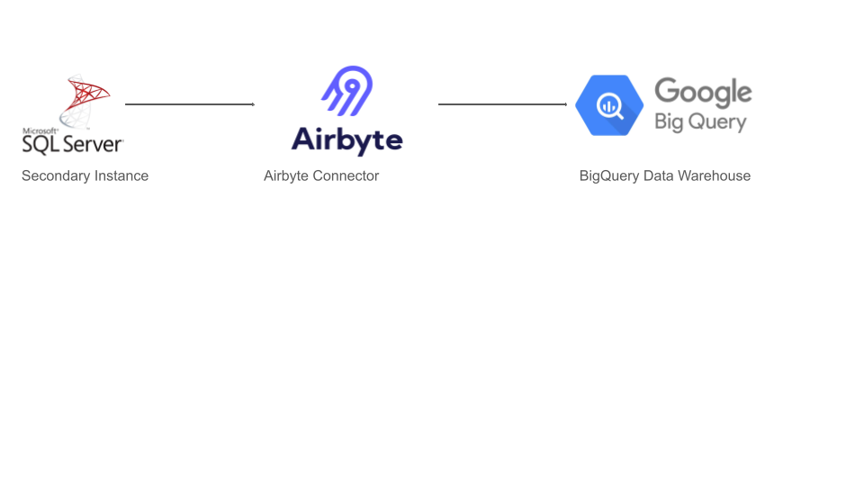

# Bumpa ETL Case Study

This repository contains the full data engineering and analytics workflow for a fictional Bumpa e-commerce dataset, executed by **Adedamola Onabanjo** as part of a technical assessment.

---

## Project Overview

The pipeline demonstrates an end-to-end ETL and BI process:
- Ingest raw transactional data
- Transform into clean, enriched layers
- Test for quality
- Build aggregated marts
- Analyze key trends
- Present insights via a professional dashboard

---

## Tech Stack

- **BigQuery** for data storage and transformation
- **Airbyte** for proposed production ingestion
- **Looker Studio** for visualization
- **GitHub** for version control
- **Google Sheets** for alert logging

---

## Ingestion Strategy

### Proposed Production Ingestion:
We assume Bumpa's Line of Business (LOB) apps are hosted on **MSSQL**.

- Use **Airbyte MSSQL connectors** for Change Data Capture (CDC)
- Ingest into staging tables in **BigQuery**
- Optionally isolate CDC from core application DBs using **replication on secondary MSSQL instance**



---

## Data Modeling Approach

Modeled using the **layered approach**:
```
raw → staging → core → marts → dashboard
```

Each table performs:
- Standardization at the staging layer
- Enrichment and business logic at the core layer
- Aggregation at the mart layer

---

## QA Testing Framework

All key transformations were tested via SQL-based assertions:
- Null checks (`order_id`)
- Delivery status validation
- Business logic range checks
- Logging via scheduled query to `test_results_log`

Test queries reside in [`sql/tests/`](sql/tests/).

---

## Job Scheduling Logic

| Job | Time (WAT) |
|-----|------------|
| `test_results_log` | 06:30 AM |
| `stg_customer_orders` | 07:00 AM |
| `int_orders` | 07:15 AM |
| `fct_order_summary` | 07:30 AM |

This ensures tests run **before** data is transformed downstream.

---

## Folder Structure

```
sql/
  ├─ staging/
  ├─ core/
  ├─ marts/
  ├─ tests/
  ├─ meta/
  └─ analysis/
assets/
  └─ ingestion_diagram.png
visualizations/
  └─ dashboard.pdf
report/
  └─ findings_summary.md
```

---

## Dashboard & Brand Credits

The final dashboard is in [visualizations/dashboard.pdf](visualizations/dashboard.pdf).

> **Note:** Bumpa's brand fonts, colors, and logos were sourced from [brandfetch.com](https://brandfetch.com/salescabal.com?view=library&library=default&collection=fonts) to align the visual style with the business.
